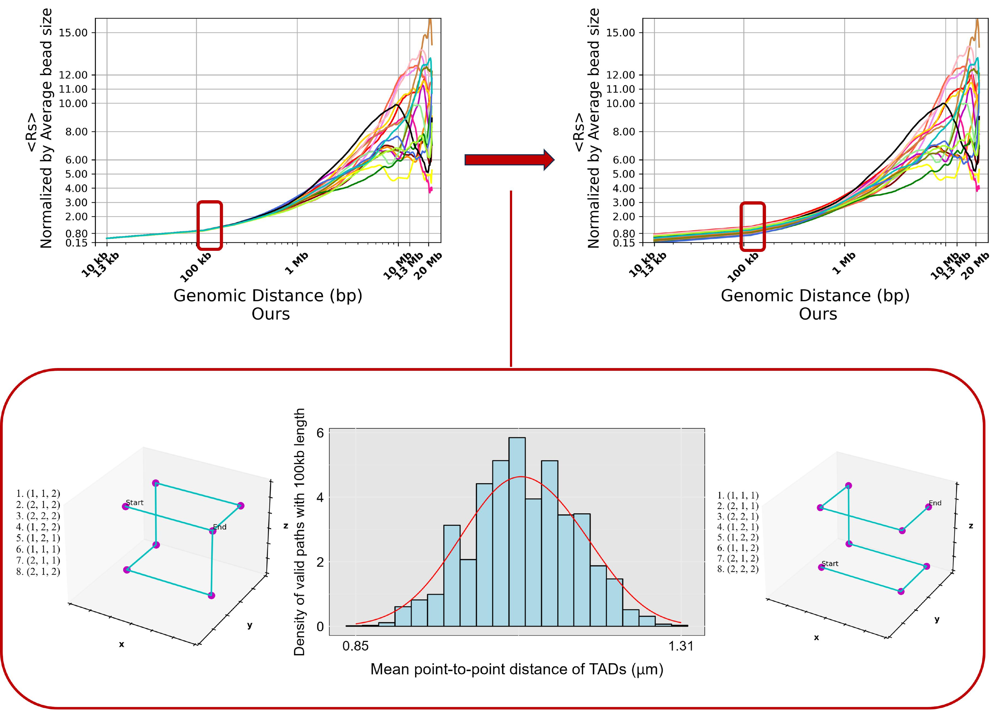

## The Spread of Euclidean Distances between Chromatin Loci among Individual Cells at Different Genomic Distances Grants a Robust Approach to Compare Single-Cell Chromatin Models
By Samira Mali, Igor S Tolokh, Erik Cross, Igor V Sharakhov, Alexey V Onufriev


## To compute the Rs plots of the genome in your model 
1. Compile the C++ code
```
g++ Rs_plots.cpp -std=c++11 -oRs_plots
```
2. Run the C++ code (Your simulation trajectory file needs to be in vtf format)
```
./Rs_plots simulation.vtf LamSites_bID_0.txt 0.2 72 72 >1st_tau_1min
```
The inputs of the C++ code include the trajectory file, the LamSites text file, the tolerance to reflect the fluctuation of a TAD shape (0.2 or 0.1 micron) and the specific time frame obtained from the selection algorithm. The algorithm is based on a defined "tau" as the maximum age of the Drosophila nuclei. We take a trajectory (one by one);
to each trajectory, we randomly choose a time-slice (a piece) within a tau. For example, the command above assume tau= 1min. The trajectory file in Ref[] include 400,000 snapshots.
The outputs are the "Rs" values corresponding to each specific genomic distance.

3. To generate the bash script to run the cpp code for different trajectories and time scales, run
 ```
python3 generation_single_cells_HiC_10min.py
```
## MC-TAD Algorithm to refine the representation of the polymer chain from the lower resolution to a higher one

1.  To generate permissible paths inside one cube using Monte Carlo algorithm, run
```
python3 3D_new_fast.py
```
2. To continues the path to the second cube with specified conditions, run
```
python3 secondCube_Box1_fast2.py
```
3. To performs statistical operations on results of MC-TAD, run
```
python3 SumArr.py 
```
## Statistics for results of MC-TAD

1. To obtain the density histogram plot of end-to-end distance of TAD chains from MC-TAD algorithm, run
```   
Rscript hist_end_to_end_distance_ggplot.R
```
- **inverse_sampling_estimate_parameters_Gauss.R**: Method to fit values to Gaussian distribution using inverse sampling.
- **combined_plots_inverse_sampling.R**: Compares the inverse sampling method to fit to the normal distribution with actual data distribution.

## Comparing different models:

- **newDistFig5d_before_shifting_up_down.py**: Draw Rs plots of this work with resolution effects.
- **newdistfig5d_New.py**: Draw Rs plots of this work considering end-to-end distance distribution and resolution effects.
- **Read_pdb_Rs_Ulianov.py**: Read files in mol2 format from reference [1] and calculates <Rs> as average elements over each diagonal in the distance matrix. So, we have 18 Rs values corresponding to each genomic distance (fixed stop).
- **new_fig_5d_Ulianov_1.py**: To draw Rs plots of Reference [1], both normalized to the TAD size and unnormalized ones (sliding window). 
- **ContactProbability_Alber_unnormalized_with_shift.py**: Both normalized and unnormalized Rs plots for 18 genomic structures out of 10000 in reference [2]. We applied the same random "shifting" as ours for consistency’s sake.  
- **End_to_end_distance_pdb_Ulianov.py**: Read every mol2 file (trajectories of Reference [1]) and calculate the end-to-end distance of the chromatin configurations.
- **end_end_distance_box_plot.py**: Compare the end-to-end distance of chromosome X in Drosophila. Basically, each boxplot shows the total configurations. It needs to be changed to the 18 ones to have consistency with the Rs plot later. 
- **boxplot_Alber_end_to_end_dist_new__difBox.py**: Compare the end-to-end distance of chromosome X in Drosophila. We chose 18 ones from both this work and Li 2017 to have consistency with the Rs plot later.
- **RadGyr_Tolokh.cpp**: Calculate the Radius of Gyration for every configuration in Tolokh 2023.
- **Radius_gyration.py**: To compare Radius of Gyration between this work and reference [2]
- **Read_pdb_Rg_Ulianov.py**: Read files in mol2 format from reference [1] and calculate the Radius of Gyration for each single cell.
- **Contact_decay_Tolokh.py**: To draw the Rs plot from the Hi-C contact map of reference [6], the Hi-C contact map related to the average over all 400K snapshots of all 18 trajectories in MD simulation for Chr X.
- **Ours_Trajectories.py**: Draw the Rs plots plus scaling for this work, directly calculated from coordinates.
- **Rs_plot_Sexton_Experiment.py**: Draw the Rs plots plus scaling for Reference [3], Drosophila population Hi-C experiment. Since there is no information regarding the spatial distance in this work, we used their contact probability data and transferred them to Rs by assuming it follows the Rouse model from Reference [4]. 
- **contact_pobability_ours.py**: Calculates and represents different regimes in scaling properties of polymer chains in this work plus reference [1], reference [2], and reference [3].


## References

[1] Ulianov, S.V., Zakharova, V.V., Galitsyna, A.A., ... Gavrilov, A.A., 2021. Order and stochasticity in the folding of individual Drosophila genomes. Nature communications, 12(1), p.41.

[2] Tolokh, Igor S., Nicholas Allen Kinney, Igor V. Sharakhov, and Alexey V. Onufriev. "Strong interactions between highly dynamic lamina-associated domains and the nuclear envelope stabilize the 3D architecture of Drosophila interphase chromatin." Epigenetics & Chromatin 16, no. 1 (2023): 1-25.

[3] Li, Qingjiao, Harianto Tjong, Xiao Li, Ke Gong, ... Alber. "The three-dimensional genome organization of Drosophila melanogaster through data integration." Genome Biology 18 (2017): 1-22.

[4] Sexton T, et al. Three-dimensional folding and functional organization principles of the Drosophila genome. Cell. 2012;148(3):458–72

[5] Shi, Guang, and Dave Thirumalai. "Conformational heterogeneity in human interphase chromosome organization reconciles the FISH and Hi-C paradox." Nature communications 10, no. 1 (2019): 3894.

[6] Gürsoy, Gamze, Yun Xu, Amy L. Kenter, and Jie Liang. "Spatial confinement is a major determinant of the folding landscape of human chromosomes." Nucleic acids research 42, no. 13 (2014): 8223-8230.


